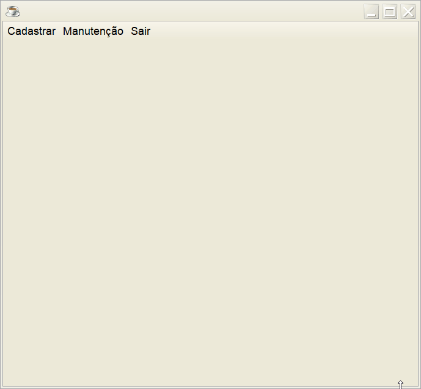
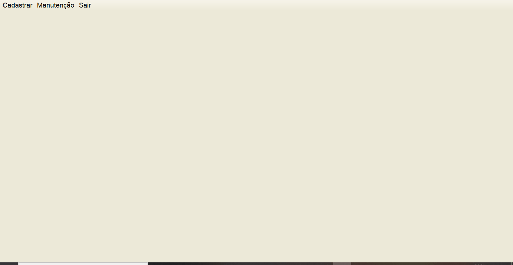

<h1 align="center">
 
  
 
 
Yachter - Your Yacht Manager
</h1>

A yachts CRUD system made for an course i've attend to.

He uses some old features, but I learned so much from him that I can't leave him out of my github.

  

[//]: # (Add your gifs/images here:)

  
  

## Features
[//]: # (Add the features of your project here:)
This app features OOP, Unit Testing, MVC and some Regex.

- * **Java Swing** — A GUI widget toolkit for Java.
- * **JTattoo** — A lib that changes the appearance of all swing applications.

## Getting started

1 - With mysql (5.1.30) and java installed run the .sql file either in terminal, mysql workbench or another application you prefer.

2 - Run the .jar file in dist dir.

3 - Enjoy!

## License

This project is licensed under the MIT License - see the [LICENSE](https://opensource.org/licenses/MIT) page for details.